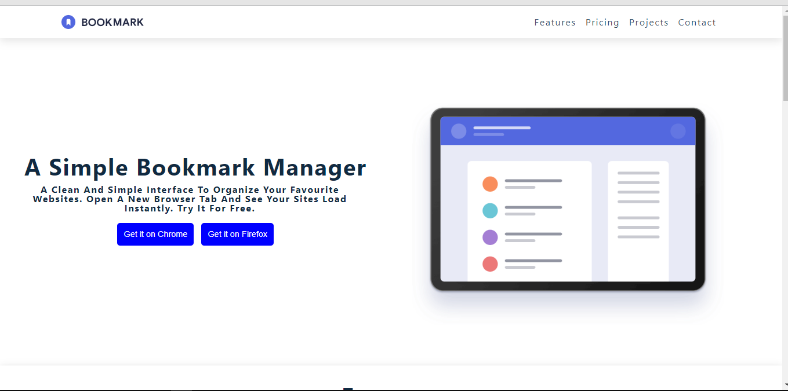

## Table of contents

- [Overview](#overview)
  - [Screenshot](#screenshot)
  - [Links](#links)
- [My process](#my-process)
  - [Built with](#built-with)
  - [HOW TO RUN](#useful-resources)
- [Author](#author)

## Overview

Built a website for a fictional browser extention,

### Screenshot

### Links

- Live Site URL: [live](https://bookmark-ce.netlify.app/)

## My process

### Built with

- Semantic HTML5 markup
- CSS custom properties
- Flexbox
- CSS Grid
- Mobile-first workflow
- [React](https://reactjs.org/) - JS library
- [Styled Components](https://styled-components.com/) - For styles

## HOW TO RUN

Clone repo then npm install

## Author

- Website - [Jeffery ikwuh](https://ikwuh-jeffery.netlify.app/)
- Twitter - [jeffery](https://twitter.com/jeffery_ikwuh)
